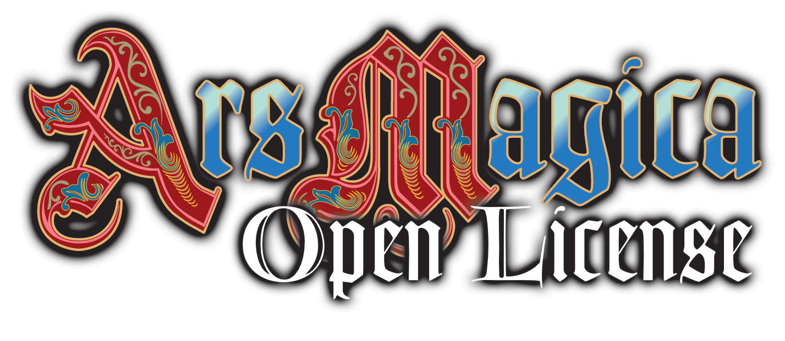

 
 

# Ars Magica – Deutsche Übersetzung (Open License)

Dieses Repository enthält eine deutsche Übersetzung des offiziellen
Ars-Magica-Open-License-Materials, basierend auf dem Quell-Repository
[OriginalMadman/Ars-Magica-Open-License](https://github.com/OriginalMadman/Ars-Magica-Open-License),
das maschinenextrahierte und manuell korrigierte Markdown-Versionen der
offiziellen Open-License-Bücher bereitstellt.

## Was ist das hier?

Atlas Games hat den vollständigen Text aller 53 Ars-Magica-5th-Edition-Bücher
unter einer offenen Lizenz veröffentlicht. Dieses Repository übersetzt dieses
Material ins Deutsche, um es deutschsprachigen Spielern zugänglich zu machen.

Diese Übersetzungen werden mit Hilfe von KI maschinell erstellt und manuell korrigiert.

Die Übersetzung umfasst (bzw. wird hoffentlich mal umfassen):
- Regeltext und Spielmechaniken
- Hintergrundmaterial zu Mythic Europe
- Ergänzungswerke (Sourcebooks)

Nicht enthalten sind: Artwork, Kartenmaterial, Grafik-Design und Logos der
Originalbücher, da diese nicht Teil der offenen Lizenz sind.

### Struktur des Repositories

* /.claude/commands/translate.md: Ein Claude-Code-Befehl zum Starten der Übersetzung eines Regelwerks
* /character-sheet: Deutscher Charakterbogen als ausfüllbares PDF mit einigen grundlegenden Berechnungen, erstellt in [Scribus](https://www.scribus.net/)
* /formatting-rules: Formaiterregeln für bestimmte wiederkehrende Elemente zur Verwendung durch die KI
* /german-reviewd: Die manuell überprüften, freigegebenen Dateien - nicht fehlerfrei, aber verwendbar
* /german-wip: Die aktuellen Arbeitsversionen, die noch bearbeitet werden
* /lektorat: Verzeichnis für die Notizen der KI-Lektoratsagenten, in .gitignore
* /original-english: Submodule-Verzeichnis für das [englische Original (Fork)](https://github.com/garin1000/Ars-Magica-Open-License)
* /tmp: Verzeichnis für temporäre Dateien während der automatischen Übersetzung
* /translation-tables: Übersetzungstabellen für wichtige Spielbegriffe, Zauber, Talente, Fehler, etc. zum Nachschlagen für die KI und manuell

### Wie wird übersetzt?

Die englischen und deutschen Übersetzungen entsprechen einander Zeile für Zeile - am Anfang manuell überprüft, mittlerweile wird das direkt von der KI übernommen. Damit das möglich ist, muss ein Absatz vollständig in einer Zeile stehen. Beim Rendern des Markdowns wird der Absatz dann passend umgebrochen. Gegebenenfalls wird dafür auch die englische Quelle angepasst, z.B. wegen Fehlern oder ungeschickten Formatierungen. Insgesamt führt das dazu, dass sehr schnell auch automatisiert in den Dateien gesucht werden kann. Alle Vorkommen eines englischen Begriffs im Original haben ihre Entsprechung in denselben Zeilen in der deutschen Übersetzung. Damit sind auch Änderungen der Begriffe nachträglich vergleichsweise einfach.

Die Hauptarbeit wird mit Claude Code erledigt (meist Opus 4.6), einzelne Absätze werden auch mal mit Perplexity mit Claude Sonnet extern übersetzt.

### Du willst helfen?

Klar, kein Problem. Aber bitte verwende die Übersetzungstabellen in /translation-tables und ergänze sie, wenn nötig, um die Übersetzung möglichst konsistent zu halten. Ansonsten wie üblich: Fork und Pull-Request.

## Lizenz

Der übersetzte Text basiert auf offiziell lizenziertem Material und steht
selbst unter der **Creative Commons Attribution-ShareAlike 4.0 International
(CC BY-SA 4.0)**.

### Pflichtangaben

Gemäß der CC-BY-SA-4.0-Lizenz ist folgende Attributionsangabe erforderlich:

> *„Based on the material for Ars Magica, ©1993–2024, licensed by Trident,
> Inc. d/b/a Atlas Games®, under Creative Commons Attribution-ShareAlike 4.0
> International license 4.0 (\"CC-BY-SA 4.0\")"*

Diese Übersetzung ist ein abgeleitetes Werk (*Adapted Material*) des
Originaltexts. Der Übersetzungstext selbst steht ebenfalls unter CC BY-SA 4.0.

### Markennamen

- **„Ars Magica"** und **„Mythic Europe"** sind Markenzeichen von Trident,
  Inc. und werden mit Genehmigung verwendet:
  > *„Ars Magica and Mythic Europe are trademarks of Trident, Inc., and are
  > used with permission."*

- **„Order of Hermes"**, **„Tremere"**, **„Doissetep"** und **„Grimgroth"**
  sind Markenzeichen von Paradox Interactive AB und werden mit Genehmigung
  verwendet:
  > *„Order of Hermes, Tremere, Doissetep, and Grimgroth are trademarks of
  > Paradox Interactive AB and are used with permission."*
  
  Diese Begriffe dürfen nur im Kontext von Ars-Magica-Material verwendet werden
  und dürfen nicht im Titel dieses Repositories oder einzelner Dokumente
  erscheinen.

## Vollständige Lizenztexte

- [CC BY-SA 4.0](https://creativecommons.org/licenses/by-sa/4.0/)
- [Ars Magica Open License (Atlas Games)](https://atlas-games.com/arsmagica/openars)